# 🚀 Flask Docker CI/CD AWS DevOps Project

This project demonstrates a **complete DevOps workflow** for deploying a Flask application using **Docker, GitHub Actions CI/CD, DockerHub, and AWS EC2**.

The objective of this project is to showcase how modern applications are **containerized, automated, and deployed to the cloud** using DevOps best practices.

---

# 🧠 Project Architecture

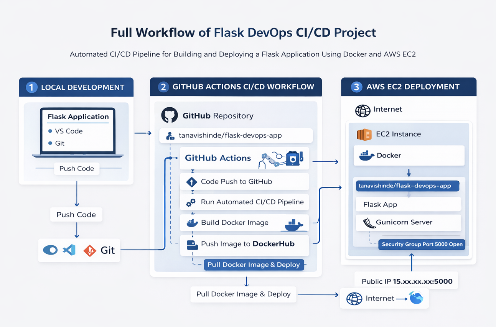

This architecture represents the **end-to-end DevOps pipeline** :

Developer → GitHub → GitHub Actions → DockerHub → AWS EC2 → Live Application

---

# 🐳 Docker Commands Used

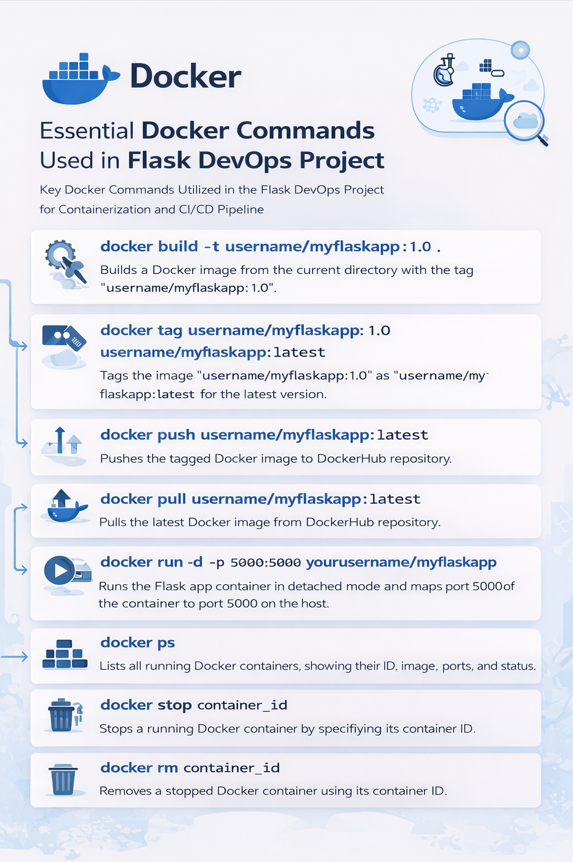

The project uses multiple Docker commands for :

- Building images
- Running containers
- Managing containers
- Pulling images from DockerHub
- Deploying to AWS EC2

---

# ⚙️ Tech Stack

- Python
- Flask
- Docker
- DockerHub
- GitHub Actions
- AWS EC2
- Linux
- CI/CD Pipeline

---

# 📂 Project Structure

```
FLASK-DOCKER-CICD-AWS-DEVOPS
│
├── .github/workflows
│     └── ci.yml
│
├── app
│     ├── app.py
│     └── requirements.txt
│
├── architecture
│     ├── commands.png
│     └── workflow.png
│
├── screenshots
│     ├── docker-build.png
│     ├── docker-container-running.png
│     ├── docker-installed-ec2.png
│     ├── docker-pull-ec2.png
│     ├── dockerhub-image.png
│     ├── ec2-connected.png
│     ├── ec2-instance.png
│     ├── flask-local.png
│     ├── github-actions.png
│     └── live-app.png
│
├── Dockerfile
├── .dockerignore
└── README.md
```

---

# 🔹 Flask Application

The Flask application contains two endpoints:

### Home Endpoint

```
/
```

Response:

```
Hello from Flask DevOps Project
```

### Health Check Endpoint

```
/health
```

Response:

```
{"status": "running"}
```

---

# 🖥️ Running Flask Locally

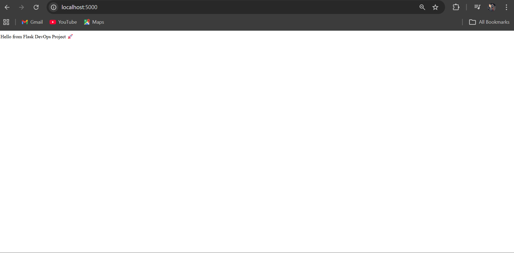

Run the application locally:

```
python app.py
```

Application runs on :

```
http://localhost:5000
```

---

# 🐳 Docker Image Build

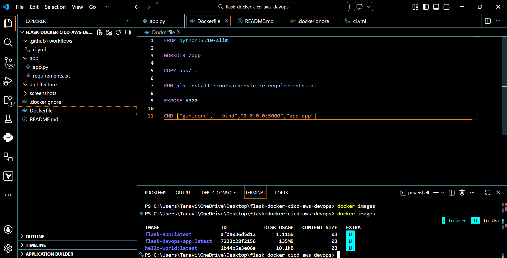

Build Docker image

```
docker build -t tanvishinde017/flask-devops-app .
```

---

# 📦 Docker Container Running

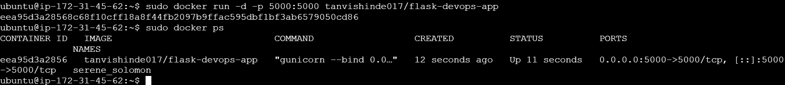

Run Docker container:

```
docker run -d -p 5000:5000 tanvishinde017/flask-devops-app
```

---

# 🔁 CI/CD Pipeline (GitHub Actions)

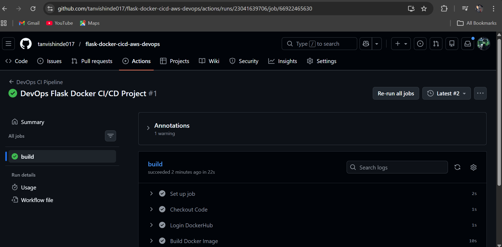

GitHub Actions automatically:

1. Detects code push
2. Builds Docker image
3. Pushes image to DockerHub

Workflow file:

```
.github/workflows/ci.yml
```

---

# 🐳 DockerHub Image

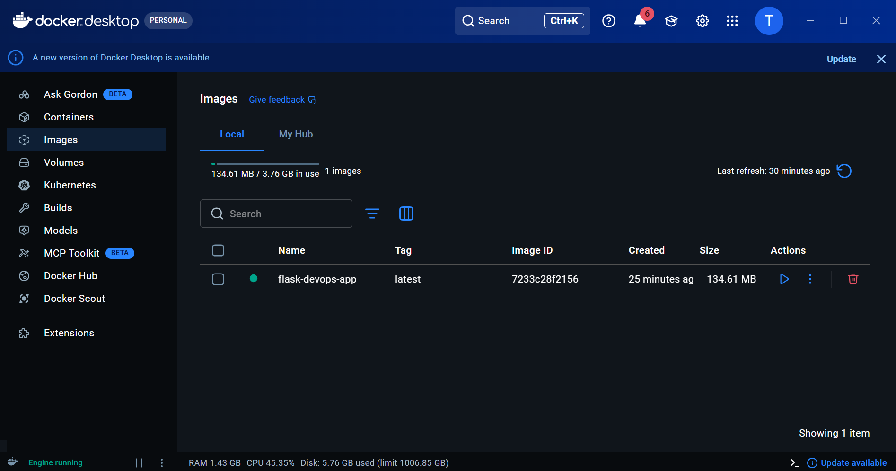

The Docker image is stored in DockerHub and used for deployment.

---

# ☁️ AWS EC2 Deployment

### EC2 Instance

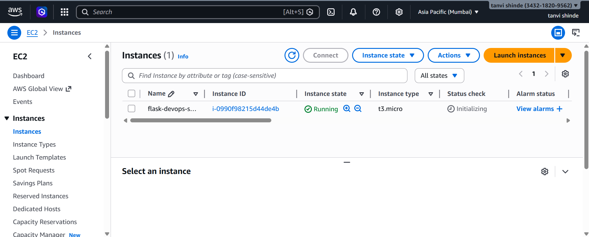

### Connected to EC2

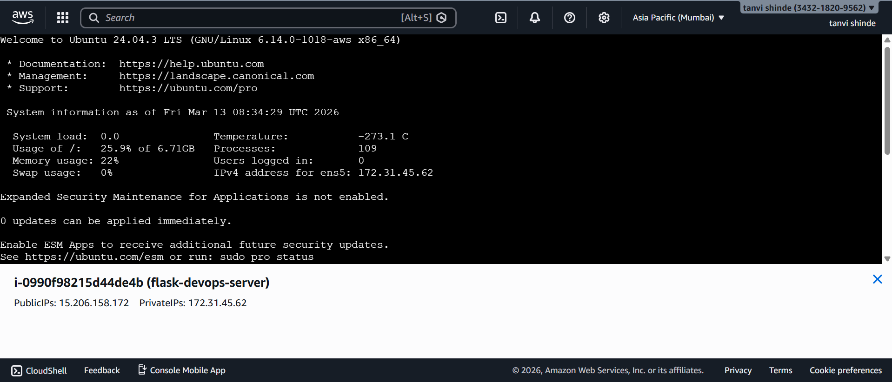

---

# 🐳 Docker Installed on EC2

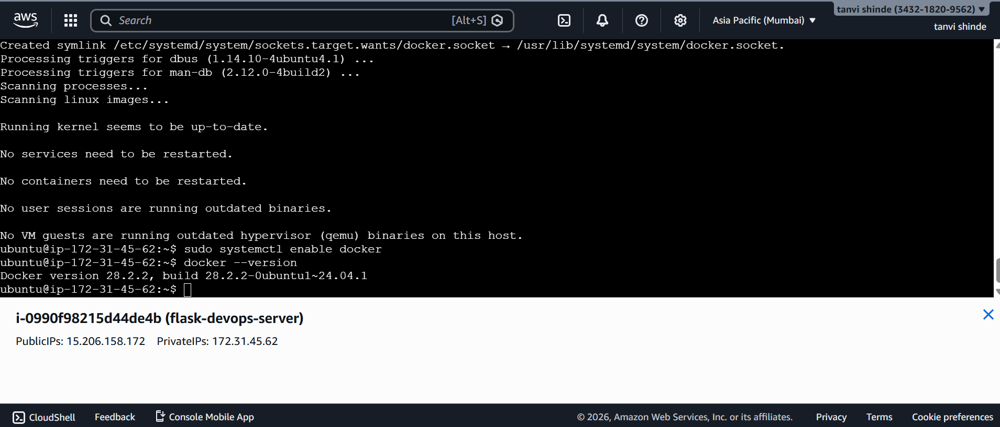

---

# 📥 Pull Docker Image on EC2

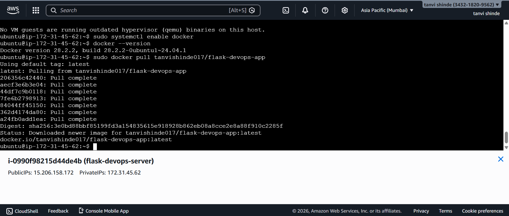

Command used:

```
docker pull tanvishinde017/flask-devops-app
```

---

# 🌍 Live Application

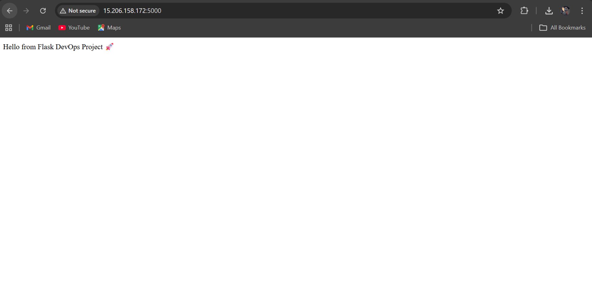

Run container on EC2:

```
docker run -d -p 5000:5000 tanvishinde017/flask-devops-app
```

Application available at:

```
http://EC2_PUBLIC_IP:5000
```

---

# 🏗️ DevOps Workflow

1️⃣ Developer pushes code to GitHub  
2️⃣ GitHub Actions CI/CD pipeline runs  
3️⃣ Docker image is built automatically  
4️⃣ Image pushed to DockerHub  
5️⃣ AWS EC2 pulls the image  
6️⃣ Docker container runs the Flask app  
7️⃣ Application becomes live on the internet

---
# ⚠️ Challenges Faced & Solutions

### ❌ Issue: Docker not running
✔ Solution: Started Docker Desktop and verified daemon status

### ❌ Issue: Port 5000 not accessible
✔ Solution: Updated AWS Security Group to allow port 5000

### ❌ Issue: Permission denied (Docker)
✔ Solution: Used `sudo` or added user to docker group

### ❌ Issue: CI/CD Docker login failed
✔ Solution: Used DockerHub Access Token instead of password

### ❌ Issue: Port already allocated .
✔ Solution: Stopped existing container using same port.

# 📌 GitHub Repository

Project Link:

https://github.com/tanvishinde017/flask-docker-cicd-aws-devops

---

# 👩‍💻 Author

**Tanavi Shinde**

DevOps | Cloud | Python | Docker | AWS
